# 🛍️ Amelia Boutique — Flutter WebView App

<p align="center">
  
</p>

<p align="center">
  <strong>A premium Flutter WebView application wrapping the <a href="https://amelia-boutique.com/">Amelia Boutique</a> website into a seamless native mobile experience.</strong>
</p>

<p align="center">
  
  
  
  
  
</p>

---

## 📽️ Demo Video

> **Place your demo/walkthrough video here**

<!-- Replace the src below with your actual video path or YouTube embed link -->
<p align="center">
  <a href="#">
    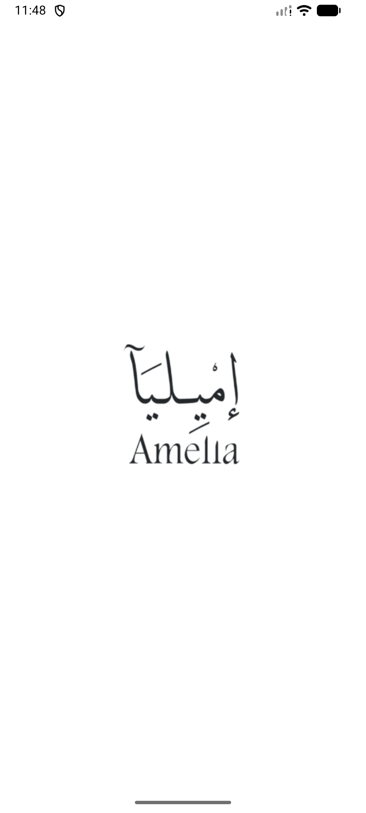
    <br/>
    ▶️ Click to watch the demo
  </a>
</p>

<!-- Alternatively, if embedding a local video: -->
<!-- <video width="320" controls>
  <source src="assets/demo.mp4" type="video/mp4">
</video> -->

| | | |
|:---:|:---:|:---:|
|  | 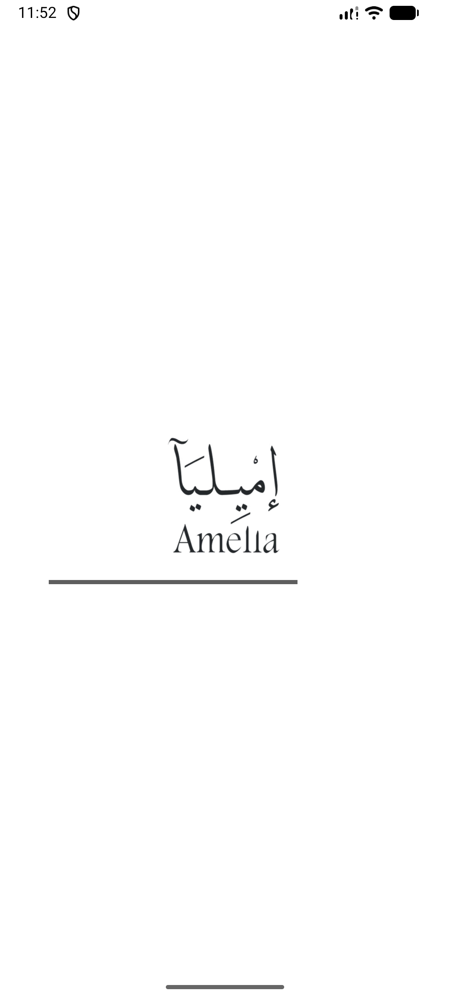 | 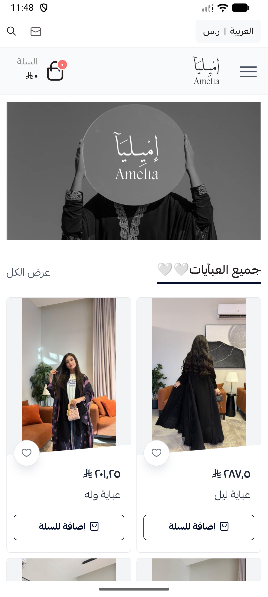 |
| 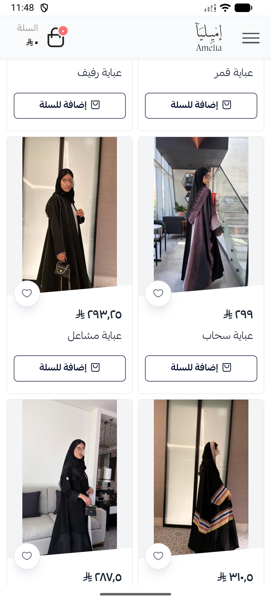 | 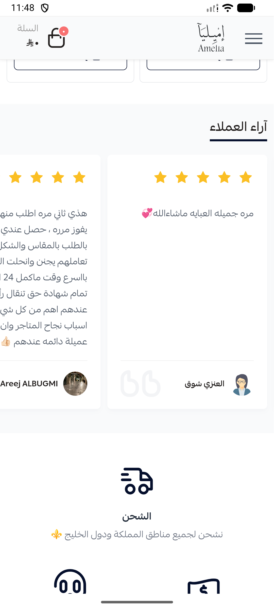 | 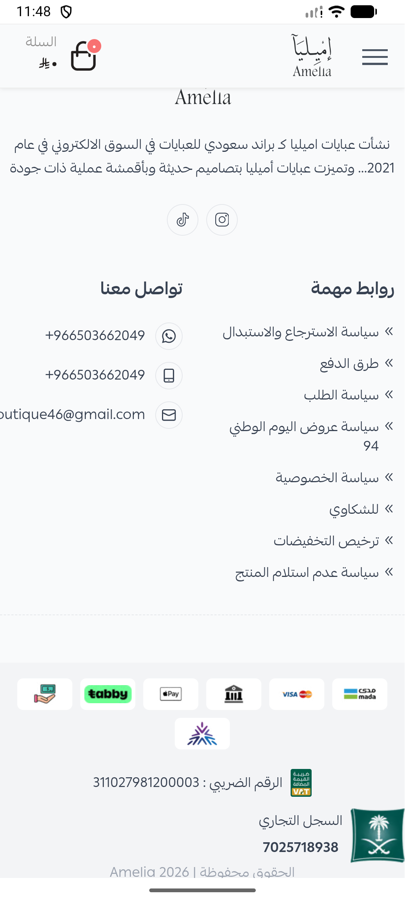 |
| 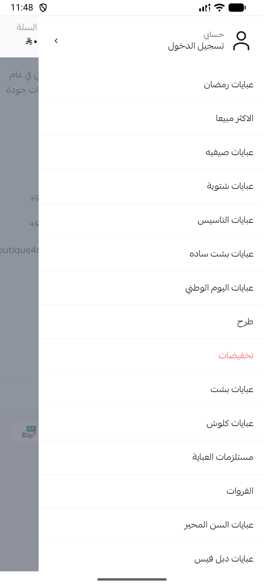 | 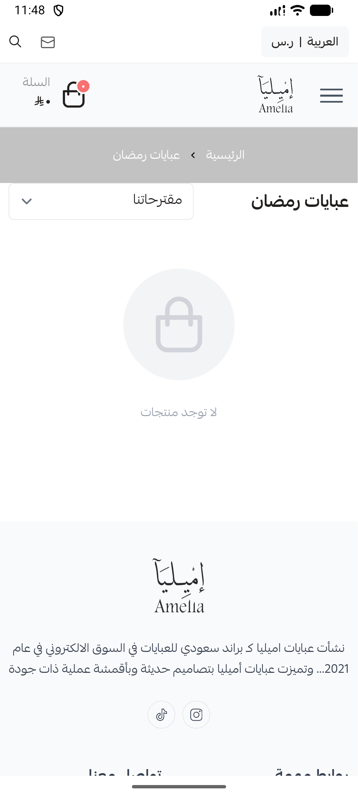 | 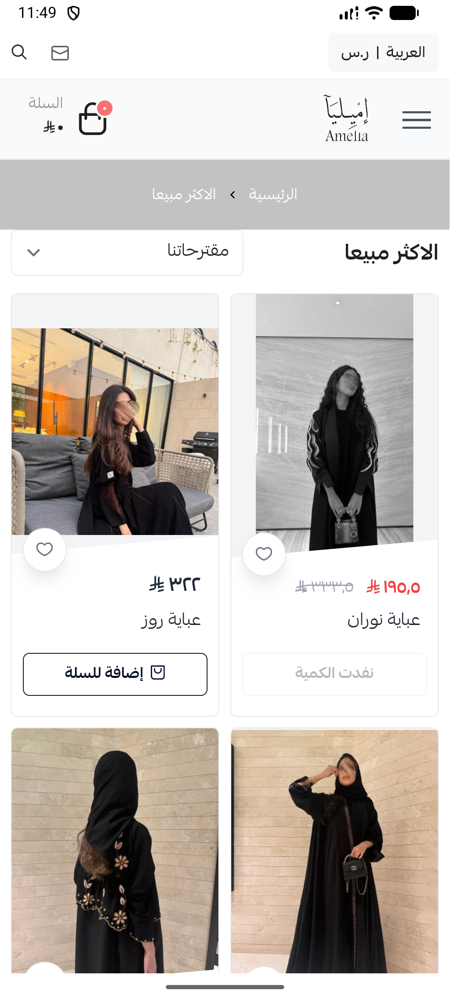 |
| 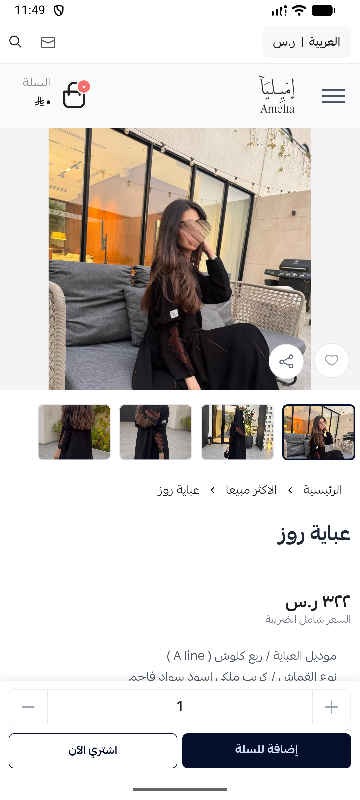 | 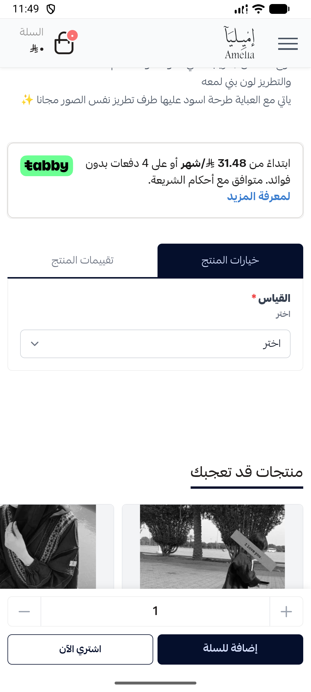 | 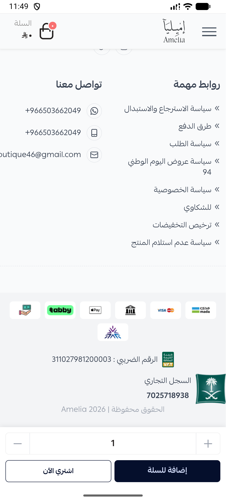 |
| 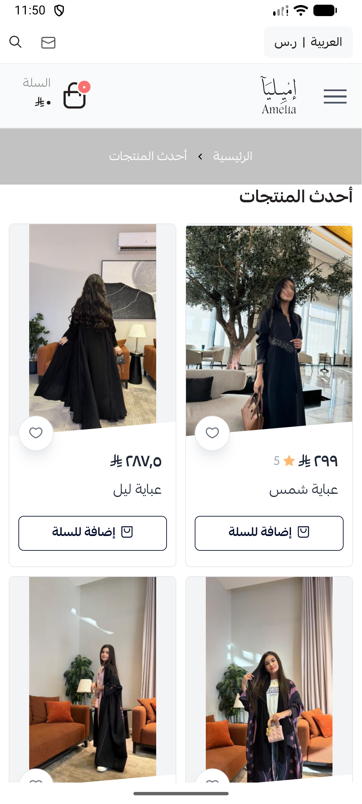 | 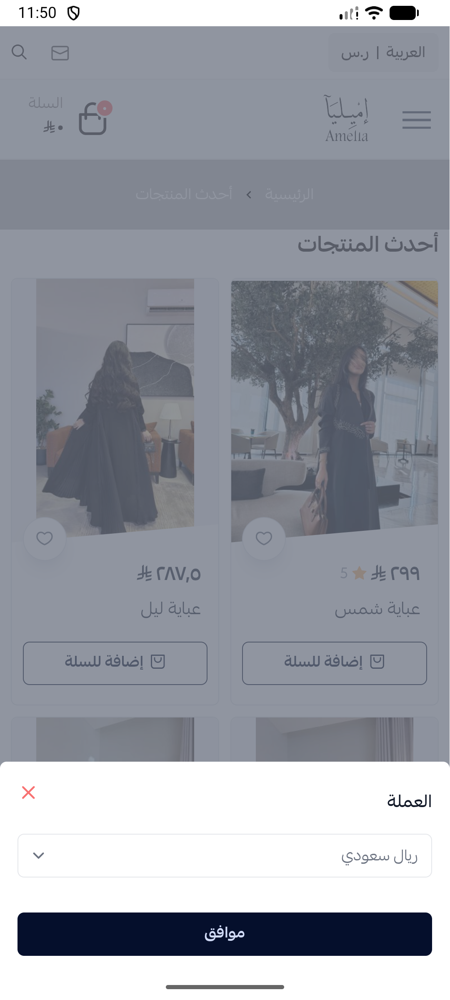 | 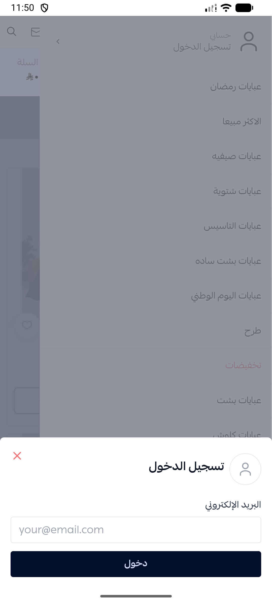 |
| 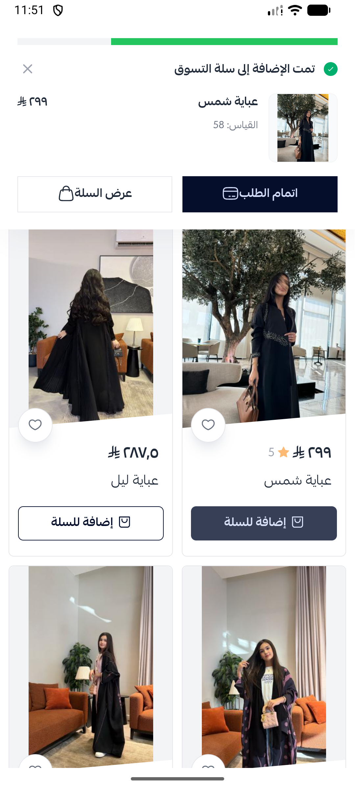 | 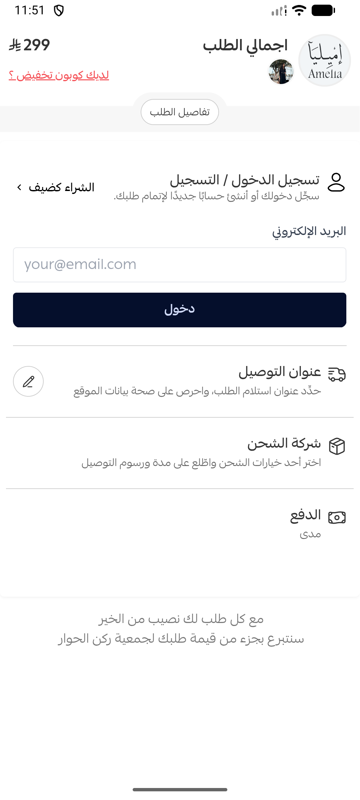 | 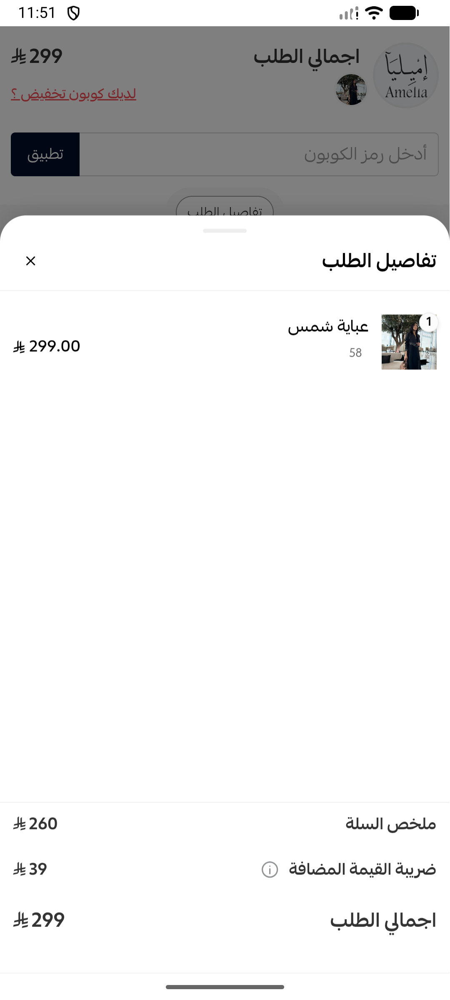 |

---

## 📖 Overview

**Amelia Boutique** is a Flutter-based mobile application that converts the e-commerce website [amelia-boutique.com](https://amelia-boutique.com/) into a fully functional Android and iOS app. The app delivers a near-native shopping experience by embedding the website inside a high-performance WebView engine, enriched with several custom features to make it feel like a true mobile-first product.

---

## ✨ Features

| Feature | Description |
|---|---|
| 🌐 **WebView Integration** | Powered by `flutter_inappwebview` for a fast, feature-rich in-app browser experience |
| 💫 **Animated Splash Screen** | Custom splash screen with app logo and animated linear progress indicator before loading |
| 📶 **Real-time Load Progress** | A branded linear progress bar shows page loading progress in real time |
| 🔙 **Hardware Back Navigation** | Android back button navigates to the previous web page instead of closing the app |
| 🔗 **Smart URL Handling** | Internal links stay in-app; external links (social media, payment gateways, etc.) open in the device's external browser |
| 🪟 **New Window Interception** | Pop-up windows and new tab requests are redirected to the system browser safely |
| 🙈 **Social Login Hiding** | JavaScript injection removes social login buttons to comply with App Store / Play Store guidelines |
| 💾 **Browser Storage Support** | DOM Storage, cookies, and database caching are enabled for a seamless session experience |
| ⚡ **Hardware Acceleration** | GPU-accelerated rendering enabled for smooth scrolling and animations |
| 🏠 **Error Recovery Screen** | Friendly Arabic error screen with **Retry** and **Go Home** options when the page fails to load |
| 🖼️ **Custom App Icon** | Branded launcher icon with adaptive icon support for Android 8+ |
| 🌅 **Native Splash Screen** | Pixel-perfect native splash screen (via `flutter_native_splash`) for instant startup feel |
| 🔤 **Cairo Arabic Font** | Custom Arabic typeface (Cairo) bundled for a fully localized UI |
| 🌍 **Multi-Platform Ready** | Targets Android, iOS, Web, Windows, macOS, and Linux from a single codebase |

---

## 🗂️ Project Structure

```
amelia/
├── lib/
│   ├── main.dart                  # App entry point — runs the App widget
│   ├── app.dart                   # MaterialApp setup, theme, and initial route
│   ├── app_constants.dart         # Centralized constants (URL, colors, assets, title)
│   ├── splash_screen.dart         # Animated splash screen (2-second auto-navigate)
│   ├── view_app.dart              # Core WebView screen with all browser logic
│   └── core/
│       ├── navigate_to_home.dart  # Reusable helper to navigate back to WebView
│       └── show_image.dart        # Reusable widget for displaying local image assets
│
├── assets/
│   ├── app_icon.png               # Main app logo / icon
│   ├── app_icon_foreground.png    # Adaptive icon foreground layer (Android)
│   ├── splash.png                 # Native splash screen image
│   ├── fonts/
│   │   └── cairo.ttf              # Cairo Arabic font
│   └── screens/                   # App screenshots for documentation
│
├── android/                       # Android-specific configuration
├── ios/                           # iOS-specific configuration
├── web/                           # Web platform entry
├── windows/                       # Windows platform entry
├── macos/                         # macOS platform entry
├── linux/                         # Linux platform entry
│
├── pubspec.yaml                   # Dependencies and asset declarations
├── flutter_launcher_icons.yaml    # Launcher icon generation config
├── flutter_native_splash.yaml     # Native splash screen config
└── analysis_options.yaml          # Dart linting rules
```

---

---

## 📦 Dependencies

| Package | Version | Purpose |
|---|---|---|
| [`flutter_inappwebview`](https://pub.dev/packages/flutter_inappwebview) | ^6.1.5 | Core WebView engine |
| [`url_launcher`](https://pub.dev/packages/url_launcher) | ^6.3.2 | Open external URLs in the system browser |
| [`flutter_native_splash`](https://pub.dev/packages/flutter_native_splash) | ^2.4.7 | Native OS-level splash screen |
| [`flutter_svg`](https://pub.dev/packages/flutter_svg) | ^2.3.0 | SVG image rendering support |
| [`rename`](https://pub.dev/packages/rename) | ^3.1.0 | App name/bundle ID renaming utility |
| [`flutter_launcher_icons`](https://pub.dev/packages/flutter_launcher_icons) | ^0.14.4 | Generates platform launcher icons |
| [`flutter_lints`](https://pub.dev/packages/flutter_lints) | ^5.0.0 | Dart/Flutter lint rules |

---

## 🚀 Getting Started

### Prerequisites

- [Flutter SDK](https://docs.flutter.dev/get-started/install) `^3.x`
- Dart SDK `^3.x`
- Android Studio / Xcode (for device builds)

### Installation

```bash
# 1. Clone the repository
git clone https://github.com/your-username/amelia.git
cd amelia

# 2. Install dependencies
flutter pub get

# 3. Run on a connected device or emulator
flutter run
```

### Generate Launcher Icons

```bash
flutter pub run flutter_launcher_icons
```

### Generate Native Splash Screen

```bash
flutter pub run flutter_native_splash:create
```

### Build for Production

```bash
# Android APK
flutter build apk --release

# Android App Bundle (for Play Store)
flutter build appbundle --release

# iOS (requires macOS + Xcode)
flutter build ios --release
```

---

## ⚙️ Configuration

All core settings are centralized in [`lib/app_constants.dart`](lib/app_constants.dart):

```dart
abstract class AppConstants {
  static const String appTitle    = 'Amelia';
  static const String initialUrl  = 'https://amelia-boutique.com/';
  static const String domain      = 'amelia-boutique.com';
  static const String appScheme   = 'amelia';
  static const String appIcon     = 'assets/app_icon.png';
  static const Color  primaryColor = Color(0xff5E5E5E);
}
```

To point the app to a different URL, simply update `initialUrl` and `domain`.

---

## 🏗️ Architecture

```
main.dart
  └── App (MaterialApp)
        └── SplashScreen  ──(2s timer)──► ViewApp
                                              ├── InAppWebView
                                              │     ├── JS Injection (hide social login)
                                              │     ├── Progress tracking
                                              │     └── URL policy (internal/external)
                                              └── Error Screen (retry / go home)
```

---

## 🤝 Contributing

This is a private client project. For any modifications or feature requests, please contact the development team directly.

---

## 📄 License

© 2026 Amelia Boutique. All rights reserved. This project is proprietary and not open for redistribution.
